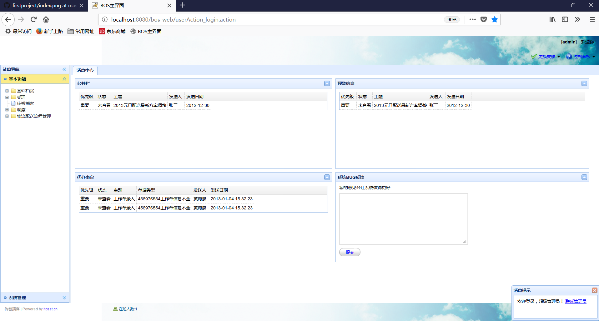
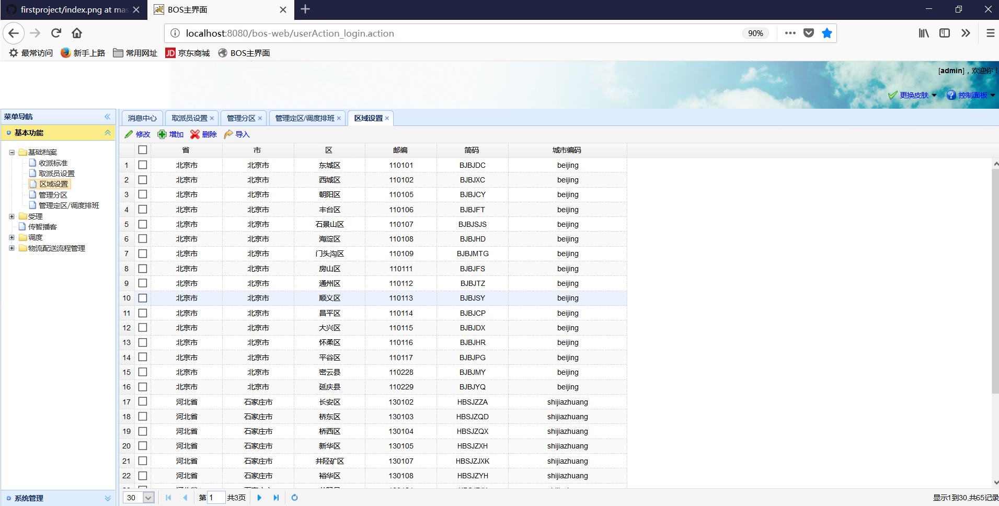

# 本项目是一个物流管理系统

- 采用Struts2与前台页面进行数据的交互
- 使用sping注解的方式管理项目中的实体和事务的管理
- 采用Hibernate进行Dao层的搭建。
- 同时用Shiro框架进行了简单的权限控制，每个用户对应不同的角色，每个角色对应有不同的权限，用户登陆需要认证，访问action时hi需要授权（动态从数据库查取用户权限）。
- 前台页面使用HignCharts处理了一个简单的图标，用easyUi搭建前台所有页面
- 使用CXF进行了服务的调用（调用的是CRM项目中发布的一个服务）
- 使用POI完成了处理excel表格长传解析数据和将数据导出成excel表格的功能
- 采用json-lib完成项目中多处用到的Object对象转JSON数组的功能
- 采用了一个MD5utils工具类进行密码的MD5加密
- 采用ehcache框架进行了简单的登陆用户的权限缓存
- 数据库使用的是mysql，最后将项目部署在linux上成功运行

## 项目页面如下：
---

---
如果你想练习可以采用本项目，fork之后clone即可，觉得对你有帮助可以给一颗星>?<

bos.sql里面存放的是sql建表语句
